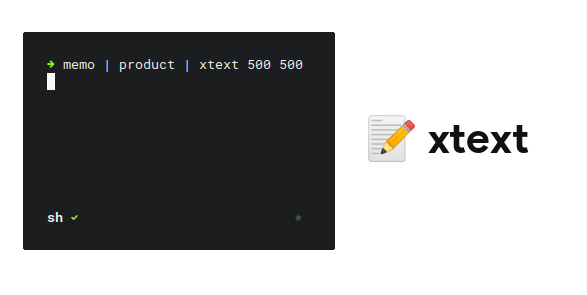

# xtext

<p align="center">
  
</p>

## Build

``` bash
cc -o xtext $(pkg-config --cflags --libs cairo pango x11 xfixes) xtext.c
```

## Usage

Pipe text into xtext and give it the coordinates of where to display:

```bash
input | xtext x y alignment
```

Alignment is an optional arguement with the following options (By default xtext uses left-alignment):

Input | Alignment
----- | ---------
0 | Left
1 | Right
2 | Center

Standard xtext structure:

```bash
(echo "Hello World!"; cat) | xtext 0 0
```

xtext is able to handle streams of text, allowing you to update what it displays:

```bash
while true; do echo $(date +%M:%S); sleep 1; done | xtext 0 0
```

## Formatting

xtext also takes advantage of Pango, a library for rendering and organizing text. Pango comes with its own markup language allowing us to add attributes to the displayed text.

```bash
(echo "<span color='red'>Hello World!</span>"; cat) | xtext 0 0
```

The Gnome Developer [docs](https://developer.gnome.org/pango/stable/PangoMarkupFormat.html) have a page dedicated to all the different Pango markup attributes. Changing the attributes becomes very powerful when paired with an updating stream of text. You can make some really interesting UI elements by changing how the text is displayed on the fly.

Take a look at the [examples/](examples/) if want to find a place to start.

## Animation

To animate text I use the following structure:

```bash
anim 'example' | effect | xtext 0 0 
```

The helper `anim` prints a given string 60 times a second. While this isn't necessary for animation, it's useful for updating a static string at a consistent rate.

Each effect reads in from STDIN, updates the given line in some way (often using a span) and then prints the new line. This can be accomplished in python using:

```python
for line in sys.stdin:
      # Update line somehow...
      print(line.strip(), flush=True)
```

All of the following effects can be found in [examples/animation/](examples/animation/)

### Fade

```bash
anim 'fade' | fade | xtext 0 0 
```

<p align="center">
  
</p>

### Transition

```bash
anim 'transition' | transition -d -10 | xtext 0 0 
```

<p align="center">
  
</p>

### Combine

```bash
anim 'fade &amp; transition' | fade | transition -d -10 | xtext 0 0 
```

<p align="center">
  
</p>

### Wave

```bash
anim 'waving' | wave | xtext 0 0 
```

<p align="center">
  
</p>

### Rainbow

```bash
anim 'rainbow' | rainbow | xtext 0 0 
```

<p align="center">
  
</p>

## Resources

X and X11 documentation contain some very murky waters. Thankfully there were a couple hidden gems out there and I would have been completely lost without them.

### C

+ [Taking input of varying sizes](https://c-for-dummies.com/blog/?p=2631)

### Xlib/X11

+ [Xlib window structure](https://www.lemoda.net/c/xlib-text-box/)
+ [Shapes, transparency, and click-thru](http://shallowsky.com/blog/programming/translucent-window-click-thru.html)

### Cairo

+ [Using cairo with Xlib](https://www.cairographics.org/Xlib/)

### Pango

+ [Pango functions](https://developer.gnome.org/pango/stable/pango-Layout-Objects.html)
+ [Pango font rendering](http://www.roxlu.com/2014/046/rendering-text-with-pango--cairo-and-freetype)
